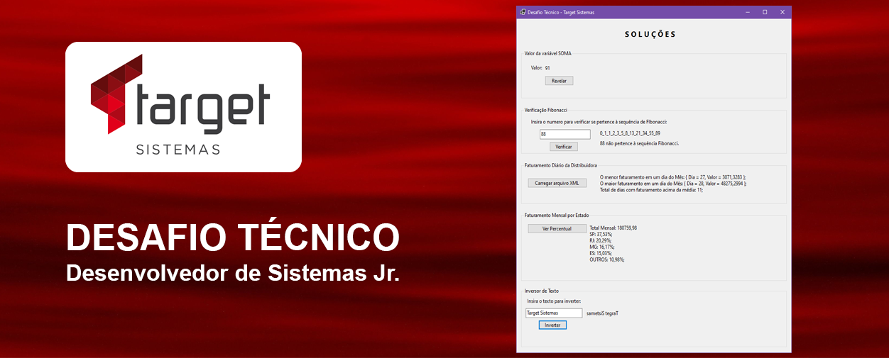

<h1 align="center"> Desafio Técnico - Target Sistemas</h1>

Este projeto apresenta as soluções para as questões do Desafio Técnico, uma das etapas do processo seletivo promovido pela plataforma Gupy, visando preenchimento da vaga de Desenvolvedor de Sistemas Jr. na empresa Target Sistemas.  
Consulte detalhes da vaga <a href="https://targetsistemas.gupy.io/job/eyJqb2JJZCI6OTExODA0NCwic291cmNlIjoiaW5kZWVkIn0=?jobBoardSource=indeed" target="_blank">clicando aqui.</a>

  <a href="#-projeto">Projeto</a>&nbsp;&nbsp;&nbsp;|&nbsp;&nbsp;&nbsp;
  <a href="#-tecnologias">Tecnologias</a>&nbsp;&nbsp;&nbsp;|&nbsp;&nbsp;&nbsp;
  <a href="#-layout">Layout</a>&nbsp;&nbsp;&nbsp;|&nbsp;&nbsp;&nbsp;
  <a href="#memo-licença">Licença</a>

  

 

  

## 💻 Projeto

Neste projeto está a resolução para os seguintes desafios:

- Identificar o valor da variável SOMA;
- Criar um programa para consultar se um número pertece à sequência de Fibonacci;
- Criar um programa que analise os dados de faturamentos diários de uma Distribuidora, identificando: O MENOR e o MAIOR faturamento de um dia do mês e o total de dias que o faturamento superou a média mensal;
- Criar um programa para calcular o percentual que o faturamento de cada Estado corresponde ao total faturado;
- Criar um programa para inverter texto;

## 🚀 Tecnologias

Esse projeto foi desenvolvido com as seguintes tecnologias:

- C#
- .NET
- Git e Github

## 🔖 Layout

O layout da aplicação é simplificado, contém apenas um windows form onde cada desafio está inserido em um Group Box, tornando bastante intuitiva a execução através de seus respectivos botões.

## :memo: Licença

Esse projeto está sob a licença MIT.

---
